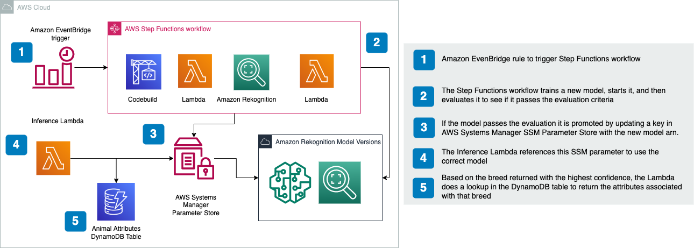
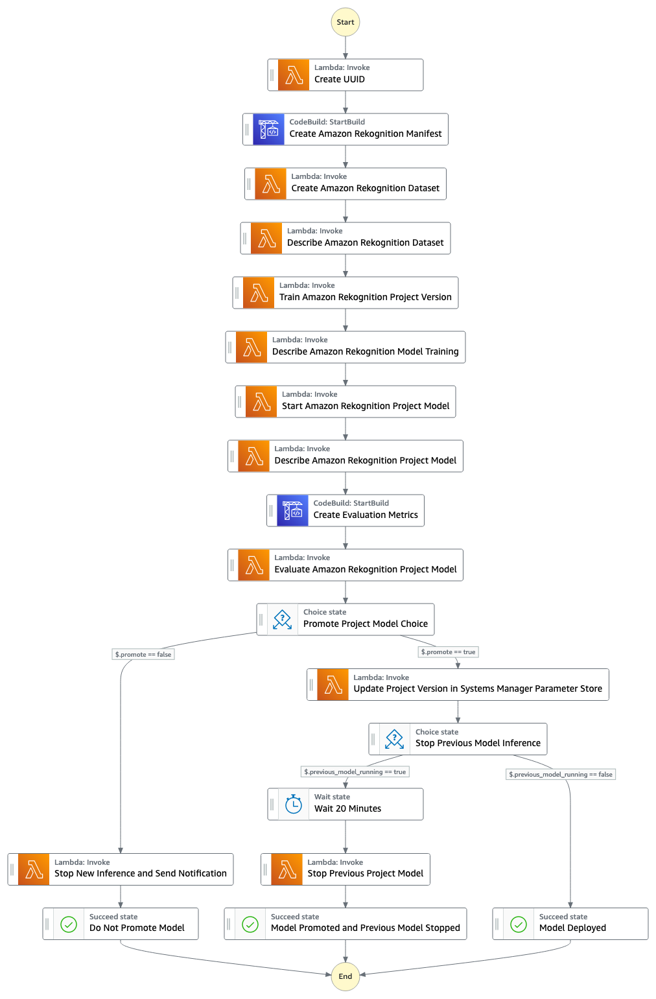

# Pet Breed Prediction with Amazon Rekognition

This repository is used to store the relevant code for pet breed prediction with Amazon Rekognition solution. This solution utilizes The Oxford-IIIT Pet Dataset to create two Amazon Rekognition Custom Labels models, one for dogs and one for cats. The AWS Lambda returns the breeds predicted by the models with an accuracy score. The Lambda also returns attributes associated with the breed with the confidence prediction that is looked up from a Amazon DynamoDB table. The breed attributes are integers for demonstration purposes but could represent characteristics like 'activity level'.


This sample code creates a AWS Step Functions workflow to manage the creation and promotion of the Amazon Rekognition Models and a Lambda to interact with the Models and give predictions.



This AWS Step Functions workflow is triggered on a time based rule set to once a week. The Step Functions workflow will generate new models for each execution and if they pass the evaluation threshold set in the config/{env}.yml they will be deployed and the previous model will be stopped.

## Setup

To start using repo, create a virtualenv:

```
$ python3 -m venv .venv
```

To activate your virtualenv.

```
$ source .venv/bin/activate
```

Once the virtualenv is activated, you can install the required dependencies.

```
$ pip install -r requirements.txt
```


## To Deploy
Requirements:
- Python3.9
- AWS CDK 2.23.0 or higher
- AWS CLI credentials configured
- AWS account with CDK bootstrapped

environment variables set:
```
export ACCOUNT_ID=12345678912
export CDK_DEPLOY_REGION=us-east-1
export CDK_ENVIRONMENT=dev
```
CDK_ENVIRONMENT refers the config/{env}.yml file

At this point you can now synthesize the AWS CloudFormation template for this code.

```
$ cdk synth
```

To deploy execute the following:
```
./deploy.sh
```
This will install the required python dependencies. After installing dependencies it will run ```cdk deploy``` to create the infrastructure. After the Cloudformation stack has been created successfully the script uploads necessary data to s3 and triggers execution of the Step Functions workflow to create both models for cats and dogs.

The initial model training and Step Functions workflow can take around 2.5 hours. You can subscribe to the Amazon Simple Notification Service (Amazon SNS) topic that the stack creates to be notified when the model has been deployed. Once the model is deployed you can then run the integration tests by executing `./integration_test.sh` to validate that the stack and models are working as expected. Prior to running the script, download a cat and dog image and add them to `/tests/data` folder titled `cat.jpg` and `dog.jpg`. After you are finished testing this solution, make sure to stop the Rekognition Models and delete any unneeded resources to avoid unnecessary charges. See [Teardown](#teardown) section for additional details.

## Executing Step Functions workflow
To execute the Step Functions workflow manually pass in one of these events through the AWS console:  
`{ "animal": "cat" }`  
`{ "animal": "dog }`

Currently the Step Functions workflow will train duplicate models using the same oxford pets data.  This provides an example of a multilabel training manifest where both species (dog or cat) and breed are predicted.  Specialized models that further predict color or other attributes could be built from more detailed annotations, and the training script could be conditioned on the animal species.

## Testing

Prior to running unit tests, add a picture of a cat and dog titled `cat.jpg` and `dog.jpg` to ./tests/data folder.

To run unit tests execute the following:
```
pytest tests/unit
```

Prior to running integration tests, add a picture of a cat and dog titled `cat.jpg` and `dog.jpg` to ./tests/data folder. To run locally you will need AWS CLI credentials configured. 


To run integration tests execute the following: 

```
./integration_test.sh
```
The integration tests assumes a 'Ragdoll' cat and 'Beagle' dog picture will be used.
If you use a different breed for the test image, the integration tests may predict a different breed and cause the test to fail which would be expected.

## Example Payload and Response

Payload:
```
{
  "animal_type": "dog",
  "image_path": "s3://dev-rekognition-use1-cfm-devrekognitionbuckets3b9-1too3s9xjckx/0.0.1/testing/dog.jpg"
}
```
Response:
```
{
	'breed': [{
		'Name': 'Beagle',
		'Confidence': 78.41899871826172,
		'Id': ''
	}, {
		'Name': 'Staffordshire Bull Terrier',
		'Confidence': 45.130001068115234,
		'Id': ''
	}, {
		'Name': 'Basset Hound',
		'Confidence': 41.560001373291016,
		'Id': ''
	}],
	'species': [{
		'Name': 'dog',
		'Confidence': 82.95999908447266,
		'Id': ''
	}, {
		'Name': 'cat',
		'Confidence': 23.236000061035156,
		'Id': ''
	}],
	'attribute_1': 3,
	'attribute_2': 1,
	'attribute_3': 1
}
```

## Teardown

To delete your resources you will need to do the following:

* Stop both cat and dog models in Rekognition Console
* Delete Rekognition projects associated to the cat and dog models that you just stopped
* Empty the S3 bucket
* Delete cloudformation stack

If you fail to cleanup resources you may encounter unexpected charges.
